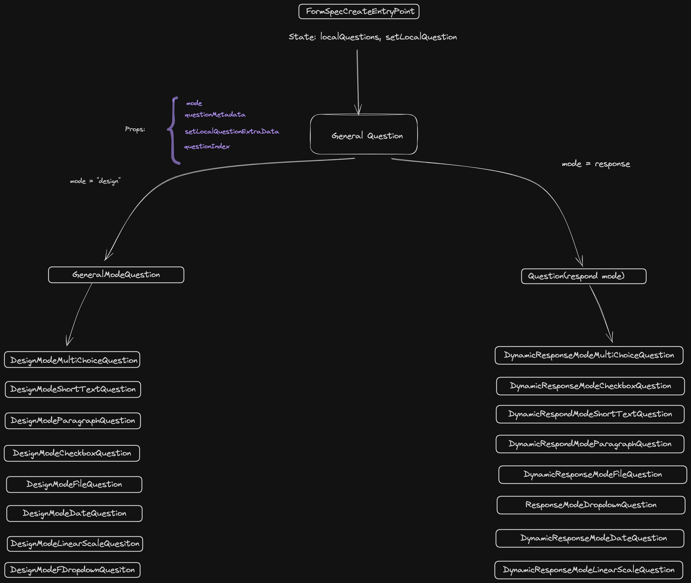
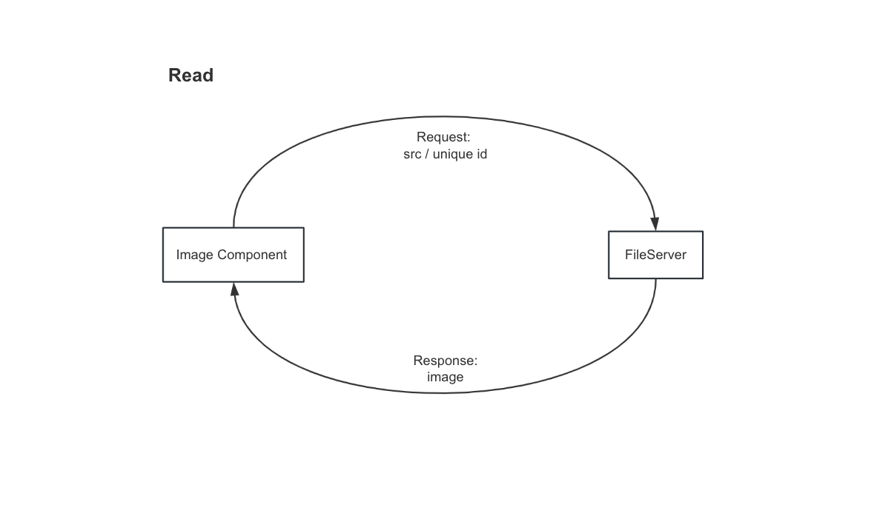
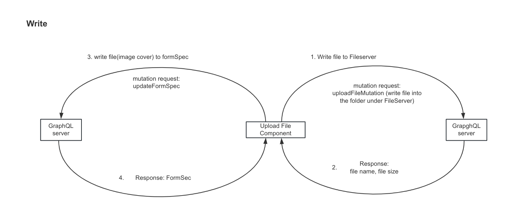

- [Overview](#overview)
- [Tech Stack](#tech-stack)
  - [Backend](#backend)
  - [Frontend](#frontend)
- [Featrures](#featrures)
- [Getting Started](#getting-started)
- [Structure](#structure)
  - [Key Componet Structure](#key-componet-structure)
- [Usage](#usage)
  - [File upload](#file-upload)
- [What's Next](#whats-next)


## Overview

EZBIZ is a dynamic form builder which is designed to streamline the creation of questionnaires, surveys, and other forms. With this application, users can effortlessly generate custom forms with various question types and logic-based visibility settings. Whether it's a simple feedback form or a complex survey with conditional branching, EZBIZ provides the functionality needed to create engaging user experiences.

## Tech Stack

### Backend
- Go: The backend of the project is developed using the Go programming language, known for its performance and concurrency support.

  - Go + GraphQL + Ent: Ezbiz utilizes GraphQL for efficient data querying and manipulation, coupled with Ent, a powerful and idiomatic ORM for Go.
  
### Frontend

- React + Relay + React Router + AntD + Jest: The frontend of EZBIZ is crafted with React, a popular JavaScript library for building user interfaces. It incorporates Relay for efficient data fetching and management, React Router for client-side routing, Ant Design for UI components, and Jest for testing.

    - **Relay** : Relay offers automatic code generation, providing strongly typed APIs for data fetching and mutation.
        
    - **React Router** : React Router is essential for enabling navigation within a single-page application, allowing users to move between different views seamlessly.


## Featrures

- **Flexible Form Creation**: Users can easily create custom forms tailored to their specific needs. The application supports various question types, including:

    - Short text
    - Paragraph
    - Multiple choice
    - Checkbox
    - Date
    - Linear scale

- **Conditional Visibility**: Users have the ability to control the visibility of questions based on responses to prerequisite questions. This feature allows for dynamic, personalized forms that adapt to the user's input.

- **Data Collection**: Once forms are created, users can seamlessly distribute them to their customers or respondents. Data submitted through the forms is collected and stored for analysis, providing valuable insights into customer feedback, preferences, and more.

- **Scripting Language**: The application implements a scripting language to support dynamic form behavior. This scripting language is divided into three main components:

    - Lexer: Responsible for breaking down the input script into tokens.
    - Parser: Parses the tokenized script and generates a syntax tree.
    - Evaluator: Executes the script and evaluates conditions to determine question visibility and other dynamic behaviors.

- **File Upload**: Users can upload files directly through the interface. These images/files are then stored on a dedicated file server. 

## Getting Started

To get started with the Dynamic Form Builder, follow these steps:

Installation: Clone the repository and install any necessary dependencies.

```
git clone https://github.com/imalexis/ezbiz.git
cd web
npm i
```

Usage: Run the application and start creating your dynamic forms.

```
cd backend
go run ./cmd/graphqld
cd web
npm run start
```

## Structure
### Key Componet Structure

The following diagram highlights critical components central to understanding the project's architecture and functionality. It focuses on key elements such as `FormSpecCreateEntryPoint`, `GeneralQuestion`, and their subdivisions into design and respond modes, along with specific question types like `DesignModeMultiChoiceQuestion` and `DynamicResponseModeMultiChoiceQuestion`. 



## Usage

### File upload




**How It Works**

  1. **Client-Side Interaction**: The user selects a file to upload through the application's user interface. This action triggers a GraphQL mutation request.
   
  2. **GraphQL Request**: The client application constructs a GraphQL request embedding the file data. This request is sent to the GraphQL server where the UploadFile mutation is defined.
   
  3. **Server-Side Processing**:
    - The server receives the file along with any metadata necessary for the upload process.
    - It processes the file, typically involving validation (e.g., checking file type, size limits) and then storing the file on a designated file server.
  
  4. Response: After the file is successfully uploaded and stored, the server responds with details about the uploaded file, such as the file name and size. These details can be used by the client application for further processing or display to the user.
   
  - **Uploading a Cover**: To upload an image, follow these steps:
    1. Navigate to the image upload section in the application.
    2. Select an image file to upload.
    3. Submit the form to upload the image. The application will handle the upload and provide feedback on success or failure.

  - **Updating Form Specifications**: After an image is uploaded:
    1. The system automatically updates the form specifications to include the uploaded image details.
    2. You can view the updated form specifications in the form management interface.

## What's Next

  The project aims to support dynamic business requirements based on the script language. For instance, it can facilitate actions such as dynamically generate emails tailored to individual users based on predefined conditions.